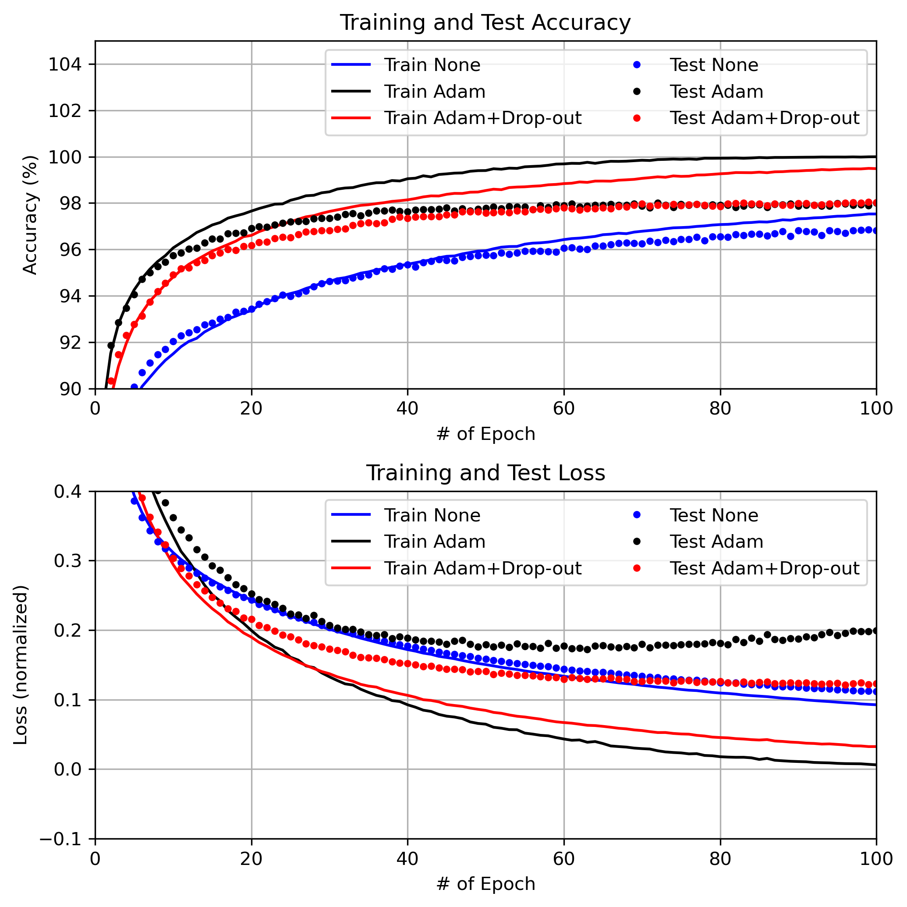
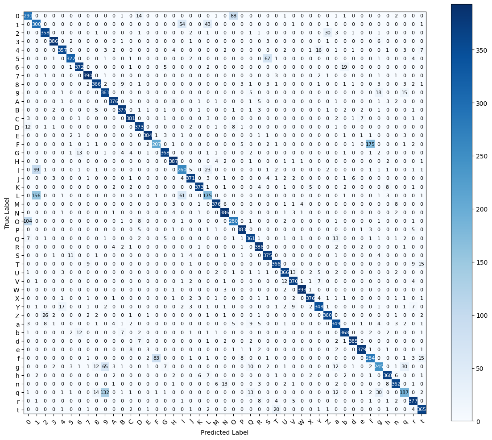
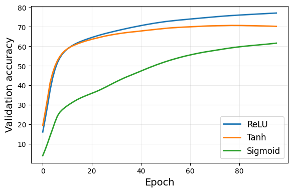
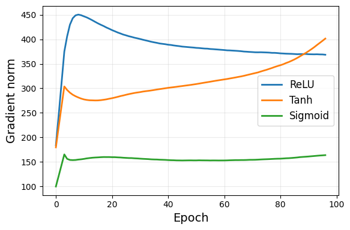

# Neural Network from Scratch (NumPy & JAX)

Implementation of a configurable feed-forward neural network built from scratch using **NumPy** and **JAX**, trained on the **EMNIST Balanced dataset (47 classes)** for handwritten character recognition.

This project was developed as part of the DTU course **02456 Deep Learning** and focuses on understanding neural network training mechanics, optimization behaviour, and performance improvements through JAX acceleration.

---

## Highlights

• Neural network implemented entirely from scratch (NumPy & JAX)  
• Trained on **EMNIST Balanced dataset (47 classes)**  
• Final model achieved **86.86% test accuracy**  
• Hyperparameter optimization using **Weights & Biases sweeps**  
• Analysis of training behaviour (activations, gradients, regularization)  
• Comparison between **NumPy and JAX implementations**

## Project Goal

The objective of the project was to build a neural network **without using high-level ML frameworks** and explore:

- Forward and backpropagation implementation
- Training dynamics across different model configurations
- Hyperparameter optimization
- Performance comparison between **NumPy and JAX implementations**
- GPU acceleration using **JAX compilation**

The model was trained to classify **47 character classes (digits and letters)** from the EMNIST Balanced dataset.

---

## Best Model Performance

Achieved through Bayesian hyperparameter optimization.

| Metric | Value |
|------|------|
| Test Accuracy | **86.86%** |
| Hidden Layers | 3 layers (512, 512, 512) |
| Activation | ReLU |
| Optimizer | Adam |
| Batch Size | 512 |
| Epochs | 100 |
| Regularization | Dropout + L2 |

Hyperparameter tuning was conducted using **Weights & Biases sweeps**.

---

## Key Features

- Neural network implemented **fully from scratch**
- Both **NumPy and JAX implementations**
- Configurable architecture
- Automated hyperparameter sweeps
- Confusion matrix evaluation
- Misclassification analysis
- Experiment tracking using **Weights & Biases**

---

## Technologies

- Python  
- NumPy  
- JAX  
- TensorFlow Datasets  
- Scikit-learn  
- Matplotlib  
- Weights & Biases  

---

## Repository Structure

    src/
        JAXNet.py
        PyNet.py

    emnist/
        JAXNet_E47B.py
        JAXNet_E47B_Sweep.py
        PyNet_E47B.py
        PyNet_E47B_Sweep.py

    mnist/
        JAXNet_M10.py
        JAXNet_M10_Sweep.py
        PyNet_M10.py
        PyNet_M10_Sweep.py

    notebooks/
        JAXNet_Colab_Single_Run.ipynb
        JAXNet_Colab_Runner.ipynb
        
    results/
        Confusion_matrix.png
        fig_adam.png
        final_val.png
        final_grad.png
        
    config/
        sweep_config.yaml

---

## Running the Project

Clone the repository:

git clone https://github.com/MathiasDyhr/neural-network-from-scratch-numpy-jax.git
cd neural-network-from-scratch-numpy-jax

Install dependencies:

pip install jax jaxlib numpy tensorflow-datasets wandb scikit-learn matplotlib

Run a single EMNIST training experiment:

python emnist/JAXNet_E47B.py

Run hyperparameter sweep:

python emnist/JAXNet_E47B_Sweep.py

---

## Model Results

### Training Performance

Training and test accuracy/loss during optimization using Adam and dropout regularization.

---

### Confusion Matrix

Performance of the final model on the EMNIST test dataset.

---

### Activation Function Comparison

Comparison of validation accuracy across different activation functions.

---

### Gradient Stability

Gradient norm behaviour during training showing the stability of different initialization strategies.

## My Contribution

This project was developed as a **DTU group project**.

My main contributions focused on:

- Experiment design and evaluation  
- Analysis of training behaviour and model performance  
- Hyperparameter experimentation  
- Misclassification analysis  
- Writing and structuring large parts of the project report  

Core neural network implementation was primarily developed by a teammate.

---

## Dataset

The project uses the **EMNIST Balanced dataset**, which contains handwritten characters including digits and letters across **47 classes**.

---

## Learning Outcomes

Through this project I gained deeper understanding of:

- Backpropagation mechanics  
- Neural network training stability  
- Effects of initialization and regularization  
- Performance improvements using JAX
- Experiment tracking and model evaluation workflows
  
